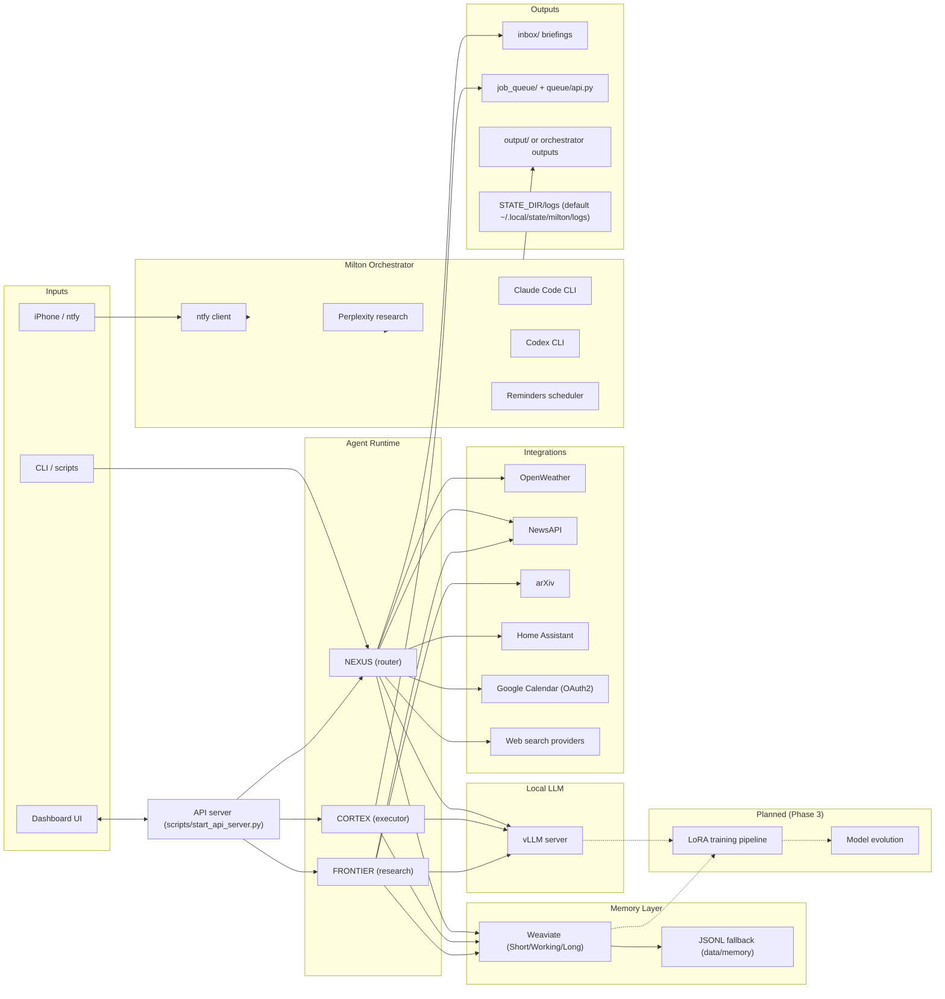

# Milton System Summary (Single Source of Truth)

This document consolidates how the Milton system works today and what it is intended to become, based only on repository contents and existing docs. Each factual statement includes file-path evidence; unknowns and gaps are explicitly called out.

## 1) Executive Summary

### What Milton is
Milton is a local-first multi-agent AI system for research, automation, and coding assistance. It runs a shared local LLM via a vLLM server, persists user context in a memory layer (Weaviate with JSONL fallback), and uses specialized agents (NEXUS/CORTEX/FRONTIER) whose prompts live in `Prompts/`. The repo also includes a separate "Milton Orchestrator" package that ingests iPhone/ntfy requests, optionally performs Perplexity research and structured prompt optimization, and dispatches code changes through Claude Code or Codex CLI; a Flask-based API server and a React dashboard provide streaming responses and system status. Runtime state (inbox, job_queue, outputs, logs, reminders) defaults to `~/.local/state/milton` and can be overridden with `STATE_DIR` (repo folders can be symlinked for legacy layouts). (Evidence: `README.md`, `scripts/start_vllm.py`, `docs/PHASE2_COMPLETE.md`, `agents/__init__.py`, `memory/backends.py`, `docs/ORCHESTRATOR_README.md`, `docs/PERPLEXITY_STRUCTURED_PROMPTING.md`, `scripts/start_api_server.py`, `milton-dashboard/README.md`, `docs/ARCHITECTURE_NAMESPACE.md`, `docs/reminders.md`)

### What it does today
- Runs local LLM inference via vLLM on port 8000; a single model is shared across agents. (Evidence: `scripts/start_vllm.py`, `docs/PHASE2_COMPLETE.md`, `README.md`)
- Maintains three-tier memory in Weaviate (short/working/long) with JSONL fallback in `data/memory/` when Weaviate is unavailable. (Evidence: `memory/init_db.py`, `memory/backends.py`, `data/memory/short_term.jsonl`, `docs/MEMORY_SPEC.md`)
- Builds deterministic, evidence-backed context packets for NEXUS and tags/stores memory items, with PhD-aware context scaling when appropriate. (Evidence: `agents/nexus.py`, `agents/memory_hooks.py`, `docs/AGENT_CONTEXT_RULES.md`, `phd_context.py`)
- Routes requests in NEXUS using deterministic rules and a tool registry; provides built-in tools for weather, arXiv, and reminders. (Evidence: `agents/nexus.py`, `agents/tool_registry.py`)
- Executes multi-step tasks in CORTEX (LLM-generated plan -> step execution -> report) and processes overnight jobs from a file-based queue. (Evidence: `agents/cortex.py`, `queue/api.py`, `scripts/job_processor.py`)
- Performs research discovery in FRONTIER via arXiv search plus optional News API usage, and supports daily discovery runs. (Evidence: `agents/frontier.py`, `integrations/arxiv_api.py`, `integrations/news_api.py`, `scripts/frontier_morning.py`)
- Automates daily OS workflows (briefings, job processing) through systemd timers and scripts, writing under `STATE_DIR` (default: `~/.local/state/milton`). (Evidence: `docs/DAILY_OS.md`, `systemd/`, `scripts/nexus_morning.py`, `scripts/job_processor.py`)
- Adds PhD-aware briefings and context system-wide, with a defined PhD research plan and tagging rules. (Evidence: `docs/PHD_BRIEFING_SYSTEM.md`, `docs/PHD_SYSTEM_WIDE_INTEGRATION.md`, `phd_context.py`, `scripts/phd_aware_morning_briefing.py`)
- Runs a voice-to-code orchestrator that ingests ntfy messages, uses Perplexity for research, and dispatches Claude Code with Codex fallback plus status updates. (Evidence: `docs/ORCHESTRATOR_README.md`, `milton_orchestrator/`, `docs/ORCHESTRATOR_COMPLETE.md`)
- Implements a persistent reminders system with SQLite storage and ntfy notifications; integrated into NEXUS and the orchestrator. (Evidence: `milton_orchestrator/reminders.py`, `docs/reminders.md`, `REMINDERS_IMPLEMENTATION_SUMMARY.md`)
- Supports mobile outputs via ntfy and tailnet-only click-to-open links using Tailscale Serve; SMB share links are documented as an alternative. (Evidence: `docs/IOS_OUTPUT_ACCESS.md`, `docs/ORCHESTRATOR_QUICKSTART.md`)
- Exposes a Flask API server and React dashboard for streaming responses and system status with read-only monitoring endpoints (health, queue, reminders, outputs, memory search). (Evidence: `scripts/start_api_server.py`, `milton-dashboard/README.md`, `tests/test_dashboard_api.py`)

### What it is intended to become
- A three-prong self-improving system that cycles memory -> LoRA training -> model evolution for continuous personalization. (Evidence: `docs/01-vision.md`, `docs/03-roadmap.md`)
- Semantic memory with embeddings, automated importance scoring, and context injection before each LLM call. (Evidence: `docs/02-current-state.md`, `docs/03-roadmap.md`, `docs/04-architecture.md`)
- A scheduled LoRA training pipeline with evaluation and rollback safeguards. (Evidence: `docs/01-vision.md`, `docs/03-roadmap.md`)
- A distilled and quantized model evolution pipeline for edge deployment (CPU/laptop/Raspberry Pi). (Evidence: `docs/01-vision.md`, `docs/03-roadmap.md`)
- Multi-user support, agent marketplace, and optional cloud hosting in later phases. (Evidence: `README.md`)

### Current maturity level
- Overall: Partial. Phase 2 is documented as operational, but Phase 3 pipelines (training and model evolution) are not implemented. (Evidence: `docs/PHASE2_COMPLETE.md`, `docs/02-current-state.md`)
- Working: vLLM inference, Weaviate memory, and agent imports are documented as passing Phase 2 tests. (Evidence: `docs/PHASE2_COMPLETE.md`, `tests/test_phase2.py`)
- Partial: deterministic memory retrieval and compression exist, but semantic search and automated context injection are missing; NEXUS evening briefing contains placeholders; some integrations depend on API keys. (Evidence: `memory/retrieve.py`, `memory/compress.py`, `docs/02-current-state.md`, `agents/nexus.py`, `docs/ERROR_SUMMARY.md`)
- Not wired: training/evolution components referenced in architecture and roadmap do not exist in the repo. (Evidence: `docs/04-architecture.md`, `docs/03-roadmap.md`, `docs/02-current-state.md`)

## 2) User Goals and Non-Goals (evidence-based)

### Goals (must-have outcomes)
- Local-first, privacy-preserving AI with no cloud dependency for inference or memory. (Evidence: `README.md`, `docs/01-vision.md`)
- Persistent memory that learns preferences and supports reproducibility and provenance. (Evidence: `README.md`, `docs/MEMORY_SPEC.md`)
- A multi-agent system with NEXUS routing, CORTEX execution, and FRONTIER discovery. (Evidence: `README.md`, `agents/`)
- Daily OS workflow: capture goals, queue overnight jobs, and generate morning/evening briefings. (Evidence: `docs/DAILY_OS.md`, `scripts/`)
- PhD-aware planning and briefings tied to a multi-year research plan. (Evidence: `docs/PHD_BRIEFING_SYSTEM.md`, `docs/PHD_SYSTEM_WIDE_INTEGRATION.md`)
- Voice-to-code orchestration from iPhone/ntfy with Perplexity research and Claude/Codex execution. (Evidence: `docs/ORCHESTRATOR_README.md`, `milton_orchestrator/`)
- Reliable reminders and notifications that persist across restarts. (Evidence: `docs/reminders.md`, `REMINDERS_IMPLEMENTATION_SUMMARY.md`)
- Mobile output delivery with click-to-open links and/or SMB access. (Evidence: `docs/IOS_OUTPUT_ACCESS.md`, `docs/ORCHESTRATOR_QUICKSTART.md`)
- Continuous self-improvement through memory, LoRA training, and model evolution (Phase 3). (Evidence: `docs/01-vision.md`, `docs/03-roadmap.md`)

### Non-goals (explicitly out of scope today)
- Continuous training and model evolution pipelines in Phase 2 (both are documented as not started). (Evidence: `docs/02-current-state.md`)
- Multi-user support in Phase 2 (planned for Phase 3). (Evidence: `README.md`)
- Cloud-hosted or SaaS deployment (Phase 4 vision only). (Evidence: `README.md`)

### Principles
- Local-first privacy: keep data and inference on local hardware. (Evidence: `README.md`)
- Evidence-backed context: only cite memory items with evidence IDs; explicitly call unknowns. (Evidence: `docs/AGENT_CONTEXT_RULES.md`, `agents/nexus.py`)
- Deterministic memory retrieval with explicit ranking rules. (Evidence: `docs/MEMORY_SPEC.md`, `memory/retrieve.py`)
- Reproducibility and provenance for outputs. (Evidence: `README.md`)
- Automation and scheduled workflows (briefings, job processing). (Evidence: `docs/DAILY_OS.md`, `systemd/`)
- PhD-first prioritization in context selection and briefings. (Evidence: `docs/PHD_SYSTEM_WIDE_INTEGRATION.md`, `phd_context.py`)

## 3) System Architecture (how Milton works)

The diagram below includes only components present in the repo; planned components are shown as dashed nodes.



Major subsystems and data flow:
- Agent runtime: `agents/nexus.py`, `agents/cortex.py`, and `agents/frontier.py` share a single LLM endpoint and store memory via the memory layer. (Evidence: `agents/*.py`, `README.md`)
- Orchestrator: the `milton_orchestrator` package is a parallel control plane that listens for ntfy requests, optionally runs Perplexity research with structured outputs, and executes Claude/Codex CLI in target repos. (Evidence: `docs/ORCHESTRATOR_README.md`, `docs/PERPLEXITY_STRUCTURED_PROMPTING.md`)
- API server and dashboard: `scripts/start_api_server.py` exposes REST and WebSocket streaming endpoints plus read-only monitoring endpoints (health, queue, reminders, outputs, memory search) expected by the React dashboard in `milton-dashboard/`. (Evidence: `scripts/start_api_server.py`, `milton-dashboard/README.md`, `tests/test_dashboard_api.py`)
- Planned training/evolution: the architecture and roadmap reference training and evolution components that are not currently present in the repo. (Evidence: `docs/04-architecture.md`, `docs/03-roadmap.md`)

## 4) Agents and Responsibilities (if present)

### NEXUS
- Role: orchestration hub, deterministic routing, tool dispatch, and briefing generation. (Evidence: `agents/nexus.py`)
- Inputs: user text, memory context packets, optional web search results, and PhD context. (Evidence: `agents/nexus.py`, `memory/retrieve.py`, `phd_context.py`)
- Outputs: Response objects with route and citations, memory entries, and briefing text (via scripts). (Evidence: `agents/nexus.py`, `scripts/nexus_morning.py`)
- Tools/integrations: weather, arXiv, reminders, web search, plus calendar/news/home status in briefings. (Evidence: `agents/nexus.py`, `integrations/`)
- Routing/delegation: deterministic keyword rules and tool matching; delegates to CORTEX/FRONTIER by calling the LLM with their prompts rather than invoking class instances. (Evidence: `agents/nexus.py`)
- Prompts: `Prompts/SHARED_CONTEXT.md` + `Prompts/NEXUS_v1.1.md` loaded via `agents/__init__.py`. (Evidence: `agents/__init__.py`)
- Status: routing and tool dispatch are implemented; evening briefing includes placeholders for tasks/queue. (Evidence: `agents/nexus.py`)

### CORTEX
- Role: execution agent for multi-step tasks and overnight job processing. (Evidence: `agents/cortex.py`, `scripts/job_processor.py`)
- Inputs: user tasks or queued job payloads. (Evidence: `agents/cortex.py`, `queue/api.py`)
- Outputs: plan JSON, step results, and a generated report per job. (Evidence: `agents/cortex.py`)
- Tools/integrations: LLM via vLLM, memory context hooks, and an optional `run_script` helper for running Python scripts. (Evidence: `agents/cortex.py`, `agents/memory_hooks.py`)
- Routing/delegation: NEXUS delegates via LLM prompt; API server instantiates CORTEX directly. (Evidence: `agents/nexus.py`, `scripts/start_api_server.py`)
- Prompts: `Prompts/SHARED_CONTEXT.md` + `Prompts/CORTEX_v1.1.md`. (Evidence: `agents/__init__.py`)
- Status: implemented but largely LLM-driven; no explicit tool execution pipeline beyond the `run_script` helper. (Evidence: `agents/cortex.py`)

### FRONTIER
- Role: research discovery, arXiv paper search, and research briefs. (Evidence: `agents/frontier.py`)
- Inputs: research topics and configured interest list. (Evidence: `agents/frontier.py`)
- Outputs: paper lists, news items, and LLM-generated briefs. (Evidence: `agents/frontier.py`)
- Tools/integrations: arXiv API, News API, LLM, memory hooks. (Evidence: `integrations/arxiv_api.py`, `integrations/news_api.py`, `agents/frontier.py`)
- Routing/delegation: NEXUS delegates via LLM prompt; API server instantiates FRONTIER directly. (Evidence: `agents/nexus.py`, `scripts/start_api_server.py`)
- Prompts: `Prompts/SHARED_CONTEXT.md` + `Prompts/FRONTIER_v1.1.md`. (Evidence: `agents/__init__.py`)
- Status: arXiv search works; news integration requires API key and is optional. (Evidence: `integrations/news_api.py`, `docs/ERROR_SUMMARY.md`)

## 5) Memory Model (if present)

### Memory tiers and retention strategy
- Short-term, working, and long-term tiers are defined as distinct Weaviate collections with retention intent in docstrings and docs. (Evidence: `memory/init_db.py`, `docs/04-architecture.md`, `docs/MEMORY_SPEC.md`)
- Short-term entries are intended to be pruned after a cutoff window (default 48 hours); working memory tracks task state; long-term stores compressed summaries and profiles. (Evidence: `memory/operations.py`, `memory/compress.py`, `docs/MEMORY_SPEC.md`)

### Storage technology
- Primary storage: Weaviate, configured via `docker-compose.yml` and `memory/init_db.py`. (Evidence: `docker-compose.yml`, `memory/init_db.py`)
- Fallback storage: JSONL files in `data/memory/` when Weaviate is unavailable or disabled. (Evidence: `memory/backends.py`, `data/memory/short_term.jsonl`)

### Schema and data models
- Weaviate collections: ShortTermMemory, WorkingMemory, LongTermMemory with schema defined in `memory/init_db.py`. (Evidence: `memory/init_db.py`)
- Local schema: `MemoryItem`, `UserProfile`, and `ProjectMemory` in `memory/schema.py`. (Evidence: `memory/schema.py`)
- Memory types: fact, preference, project, decision, crumb, request, result. (Evidence: `docs/MEMORY_SPEC.md`, `memory/schema.py`)

### Retrieval and write policies
- Deterministic ranking uses token overlap + recency bias + importance bonus. (Evidence: `docs/MEMORY_SPEC.md`, `memory/retrieve.py`)
- Agents store memory via hooks; response storage is optional and governed by env flags. (Evidence: `agents/memory_hooks.py`)
- NEXUS builds evidence-backed context packets and enforces explicit unknowns/assumptions. (Evidence: `agents/nexus.py`, `docs/AGENT_CONTEXT_RULES.md`)

### Compression and profiling
- `memory/compress.py` summarizes older short-term memories into user profiles and project summaries using evidence IDs. (Evidence: `memory/compress.py`, `memory/store.py`)
- No scheduler is wired in the repo for automated compression; it appears to be callable but not scheduled. (Evidence: `memory/compress.py`, absence of compression timers in `systemd/`)

### PhD-aware memory behavior
- PhD-related queries use larger context limits and lower recency bias, and add PhD project bullets to the context. (Evidence: `agents/nexus.py`, `docs/PHD_SYSTEM_WIDE_INTEGRATION.md`)

### Missing or not yet connected
- Semantic embeddings and vector search (`memory/embeddings.py`) are referenced in architecture docs but not present in the repo. (Evidence: `docs/04-architecture.md`, repo file listing)
- A context injection manager (`agents/context_manager.py`) is referenced in architecture docs but not present. (Evidence: `docs/04-architecture.md`, repo file listing)
- Training and evolution pipelines are described but absent. (Evidence: `docs/02-current-state.md`, `docs/03-roadmap.md`)

## 6) Integrations & Interfaces

### External services and APIs

| Integration | Purpose | Setup / config | Failure modes | Evidence |
| --- | --- | --- | --- | --- |
| vLLM server | Local inference for all agents | `scripts/start_vllm.py`, `LLM_API_URL`, `LLM_MODEL` | Agents return "LLM unavailable" if endpoint is down | `scripts/start_vllm.py`, `agents/nexus.py`, `README.md` |
| Weaviate | Memory store | `docker-compose.yml`, `WEAVIATE_URL` | JSONL fallback used when Weaviate is down | `docker-compose.yml`, `memory/backends.py` |
| OpenWeather | Weather in briefings/tool | Use OPENWEATHER_API_KEY; WEATHER_API_KEY is supported for backward compatibility. `WEATHER_LAT`, `WEATHER_LON` (preferred), `WEATHER_LOCATION` fallback | Raises error if key missing | `integrations/weather.py`, `docs/MORNING_BRIEFING_GUIDE.md` |
| NewsAPI | News in briefings/frontier | `NEWS_API_KEY` | 401 if key missing | `integrations/news_api.py`, `docs/ERROR_SUMMARY.md` |
| arXiv | Paper search | No key required | Network errors | `integrations/arxiv_api.py`, `agents/frontier.py` |
| Home Assistant | Home status integration | `HOME_ASSISTANT_URL`, `HOME_ASSISTANT_TOKEN` | Connection refused if service not running | `integrations/home_assistant.py`, `docs/IMPLEMENTATION_PLAN.md`, `docs/ERROR_SUMMARY.md` |
| Google Calendar | Calendar events (OAuth2 read-only) | OAuth2 client secret and token in `STATE_DIR/credentials/` | Falls back to mock mode if credentials unavailable | `integrations/calendar.py`, `docs/CALENDAR.md`, `tests/test_calendar.py` |
| Web search providers | Optional web lookup | API keys referenced in code (not documented in `.env.example`) | Returns empty results on failure | `integrations/web_search.py`, `agents/nexus.py` |
| Perplexity | Orchestrator research | `PERPLEXITY_API_KEY`, `PERPLEXITY_MODEL` | Requests fail if key missing | `docs/ORCHESTRATOR_README.md`, `milton_orchestrator/perplexity_client.py` |
| Claude Code CLI | Code execution | `CLAUDE_BIN` | Fallback to Codex if Claude unavailable/limited | `docs/ORCHESTRATOR_README.md`, `milton_orchestrator/claude_runner.py` |
| Codex CLI | Fallback code execution | `CODEX_BIN`, `CODEX_MODEL` | Execution fails if CLI missing | `docs/ORCHESTRATOR_README.md`, `milton_orchestrator/codex_runner.py` |
| ntfy | Messaging and notifications | `NTFY_BASE_URL`, `ASK_TOPIC`, `ANSWER_TOPIC`, `NTFY_TOPIC` (reminders) | No delivery if topic mismatch or network issues | `docs/ORCHESTRATOR_README.md`, `docs/reminders.md`, `scripts/ask_from_phone.py` |

### Interfaces and IO channels

| Interface | Purpose | Evidence | Notes |
| --- | --- | --- | --- |
| CLI/scripts | Manual runs for briefings, health checks, vLLM, API server | `scripts/` | Primary operational surface for Phase 2 |
| Systemd timers/services | Scheduled briefings and job processing | `systemd/` | Uses user-level systemd units |
| ntfy iPhone ingestion | Ask/answer loop and reminders | `docs/ASK_MILTON_FROM_IPHONE.md`, `scripts/ask_from_phone.py`, `systemd/milton-phone-listener.service` | Production systemd service with security hardening; supports message prefix routing (claude:/cortex:/frontier:/status:/briefing:) |
| API server + dashboard | Streaming responses and read-only system monitoring | `scripts/start_api_server.py`, `milton-dashboard/README.md`, `tests/test_dashboard_api.py` | Dashboard expects backend on port 8001; provides health, queue, reminders, outputs, memory search endpoints |
| File outputs | Briefings, job results, archives | `STATE_DIR/inbox`, `STATE_DIR/job_queue`, `STATE_DIR/outputs` | `STATE_DIR` can redirect paths |

### Remote access model
- Tailnet-only click-to-open: Tailscale Serve provides a HTTPS base URL for output files, consumed via ntfy notifications. (Evidence: `docs/IOS_OUTPUT_ACCESS.md`, `scripts/setup_tailscale_serve_outputs.sh`)
- SMB share alternative: outputs can be exposed via SMB with `OUTPUT_SHARE_URL` configuration. (Evidence: `docs/ORCHESTRATOR_QUICKSTART.md`)
- SSH access from iPhone is described as an alternative for manual access. (Evidence: `docs/ASK_MILTON_FROM_IPHONE.md`)

## 7) Operational Runbook (how to run Milton)

### Prerequisites
- Linux host; orchestrator docs specify Ubuntu or compatible Linux. (Evidence: `docs/ORCHESTRATOR_README.md`)
- Python 3.10+ for core agents, Python 3.11+ for orchestrator. (Evidence: `README.md`, `docs/ORCHESTRATOR_README.md`)
- Conda environment named `milton`. (Evidence: `README.md`, `docs/ORCHESTRATOR_README.md`)
- Docker for Weaviate. (Evidence: `README.md`, `docs/PHASE2_DEPLOYMENT.md`)
- NVIDIA GPU with sufficient VRAM for vLLM (12GB+ recommended). (Evidence: `README.md`)
- Node 18+ and npm for the dashboard. (Evidence: `milton-dashboard/README.md`)
- Optional: ntfy topics and keys, Perplexity API key, Claude/Codex CLI installations. (Evidence: `docs/ORCHESTRATOR_README.md`, `docs/ASK_MILTON_FROM_IPHONE.md`)

### Startup sequence (in words)
1. Start the Weaviate service and initialize the memory schema if needed. (Evidence: `docker-compose.yml`, `memory/init_db.py`, `docs/PHASE2_DEPLOYMENT.md`)
2. Start the vLLM server with the configured model. (Evidence: `scripts/start_vllm.py`, `docs/PHASE2_DEPLOYMENT.md`)
3. Run core agents directly (CLI/scripts) or start the API server for dashboard usage. (Evidence: `scripts/`, `scripts/start_api_server.py`)
4. If using the orchestrator, install and run the `milton-orchestrator` service and configure ntfy topics and API keys. (Evidence: `docs/ORCHESTRATOR_README.md`, `systemd/milton-orchestrator.service`)
5. If using reminders, run the reminders scheduler or enable its systemd service. (Evidence: `docs/reminders.md`, `systemd/milton-reminders.service`)
6. Enable systemd timers for daily briefings and job processing if automation is desired. (Evidence: `systemd/`, `docs/DAILY_OS.md`)

### Logs and state locations
- Agent scripts write logs under `STATE_DIR/logs/` (default: `~/.local/state/milton/logs/`). (Evidence: `scripts/nexus_morning.py`, `scripts/job_processor.py`, `scripts/frontier_morning.py`)
- Orchestrator logs and outputs live under `~/.local/state/milton/` by default. (Evidence: `docs/ORCHESTRATOR_README.md`)
- Reminders database defaults to `~/.local/state/milton/reminders.sqlite3`. (Evidence: `docs/reminders.md`)
- Briefing outputs are written under `STATE_DIR/inbox/`. (Evidence: `scripts/nexus_morning.py`, `docs/DAILY_OS.md`)

### Common failure points and diagnostics
- vLLM down or misconfigured: agents return "LLM unavailable"; ensure vLLM is running and `LLM_API_URL` is correct. (Evidence: `agents/nexus.py`, `docs/PHASE2_DEPLOYMENT.md`)
- Weaviate down or Docker permissions: memory operations fail or fall back to JSONL. (Evidence: `docs/PHASE2_DEPLOYMENT.md`, `memory/backends.py`)
- Missing API keys (Weather/News/Home Assistant/Perplexity): integrations fail or return empty results. (Evidence: `integrations/weather.py`, `integrations/news_api.py`, `docs/ERROR_SUMMARY.md`, `docs/ORCHESTRATOR_README.md`)
- ntfy topic mismatch: no inbound/outbound mobile messages. (Evidence: `docs/ORCHESTRATOR_README.md`, `docs/ASK_MILTON_FROM_IPHONE.md`)
- Dashboard not receiving data: API server not running on expected port. (Evidence: `milton-dashboard/README.md`, `scripts/start_api_server.py`)

## 8) Repo Map (grounded in reality)

Top-level structure (2-3 levels):

```
milton/
├── agents/                 # NEXUS, CORTEX, FRONTIER
├── agent_logging/          # logging utilities (mostly referenced in tests)
├── docs/                   # documentation
│   └── legacy/             # legacy/unrelated references
│       └── milton_delaware_ami_architecture_report.md  # municipal AMI RFQ summary
├── integrations/           # weather, arXiv, news, home assistant, Google Calendar (OAuth2), web search
├── memory/                 # Weaviate + JSONL memory, schema, compression
├── milton_orchestrator/    # ntfy, Perplexity, Claude/Codex, reminders
├── milton-dashboard/       # React dashboard + frontend docs
├── scripts/                # automation scripts, API server, setup helpers
├── systemd/                # user services/timers (nexus, frontier, job processor, orchestrator, reminders)
├── queue/                  # file-based queue API + jobs.db
├── job_queue/              # queue storage (tonight/archive)
├── inbox/                  # briefing outputs
├── output/                 # consolidated outputs
├── data/memory/            # JSONL fallback memory
├── tests/                  # unit/integration tests
├── Prompts/                # agent prompts and shared context
├── docker-compose.yml      # Weaviate service
└── .env.example            # orchestrator config template
```

### Inconsistencies / drift to resolve
- `docs/SYSTEM_DOCUMENTATION.md` references `config/` and `logging/` directories that are not present; prompts actually live in `Prompts/` and logging utilities are under `agent_logging/`. (Evidence: `docs/SYSTEM_DOCUMENTATION.md`, `agents/__init__.py`, `agent_logging/`)
- `docs/04-architecture.md` references `memory/embeddings.py`, `agents/context_manager.py`, and `training/`/`evolution/` directories that are missing. (Evidence: `docs/04-architecture.md`)
- `docs/MORNING_BRIEFING_GUIDE.md` references `milton-morning-briefing.*` systemd units that do not exist; repo contains `milton-nexus-morning.*`. (Evidence: `docs/MORNING_BRIEFING_GUIDE.md`, `systemd/`)
- `docs/ASK_MILTON_FROM_IPHONE.md` references `milton-phone-listener` systemd service, but the repo only has `scripts/ask_from_phone.py` and no service unit. (Evidence: `docs/ASK_MILTON_FROM_IPHONE.md`, `scripts/ask_from_phone.py`, `systemd/`)
- Weather API key naming policy: Use OPENWEATHER_API_KEY; WEATHER_API_KEY is supported for backward compatibility. (Evidence: `docs/02-current-state.md`, `integrations/weather.py`)

## 9) Truth Table: What Works vs What is Planned

| Feature | Status | Evidence |
| --- | --- | --- |
| Local vLLM inference | Works | `scripts/start_vllm.py`, `docs/PHASE2_COMPLETE.md` |
| Weaviate memory schema | Works | `memory/init_db.py`, `docs/PHASE2_COMPLETE.md` |
| JSONL fallback memory | Works | `memory/backends.py`, `data/memory/short_term.jsonl` |
| Deterministic memory retrieval | Works | `memory/retrieve.py`, `docs/MEMORY_SPEC.md` |
| NEXUS routing and tools | Works | `agents/nexus.py`, `agents/tool_registry.py` |
| CORTEX plan/execute/report flow | Partial | `agents/cortex.py`, `scripts/job_processor.py` |
| FRONTIER research discovery | Partial | `agents/frontier.py`, `integrations/news_api.py` |
| Daily OS systemd automation | Works | `systemd/`, `docs/DAILY_OS.md` |
| iPhone ask/answer listener | Works | `scripts/ask_from_phone.py`, `docs/ASK_MILTON_FROM_IPHONE.md`, `systemd/milton-phone-listener.service`, `tests/test_phone_listener.py` |
| Orchestrator (ntfy -> Perplexity -> Claude/Codex) | Works | `milton_orchestrator/`, `docs/ORCHESTRATOR_COMPLETE.md` |
| Reminders system | Works | `milton_orchestrator/reminders.py`, `docs/reminders.md` |
| Dashboard + API server | Works | `milton-dashboard/README.md`, `scripts/start_api_server.py`, `tests/test_dashboard_api.py`, `docs/DASHBOARD_API_DOD_CHECKLIST.md` |
| Calendar integration | Works | `integrations/calendar.py`, `tests/test_calendar.py`, `docs/CALENDAR.md`, `docs/CALENDAR_DOD_CHECKLIST.md` |
| Semantic memory embeddings | Planned | `docs/02-current-state.md`, `docs/03-roadmap.md` |
| LoRA training pipeline | Planned | `docs/02-current-state.md`, `docs/03-roadmap.md` |
| Model evolution pipeline | Planned | `docs/01-vision.md`, `docs/03-roadmap.md` |
| PhD-aware context + briefings | Works | `phd_context.py`, `docs/PHD_SYSTEM_WIDE_INTEGRATION.md` |
| Tailscale click-to-open outputs | Works | `docs/IOS_OUTPUT_ACCESS.md`, `scripts/setup_tailscale_serve_outputs.sh` |

## 10) Roadmap (practical next steps)

### Foundational plumbing
- Implement conversation export from memory to training data as described in the roadmap; DoD: `training/export_conversations.py` exists and produces a JSONL dataset with sensitive-data filtering and >=100 pairs. (Evidence: `docs/03-roadmap.md`, `docs/02-current-state.md`)
- Implement LoRA fine-tuning script and evaluation harness; DoD: `training/lora_finetune.py` runs and produces an adapter under `checkpoints/lora_adapters/` with logged evaluation metrics. (Evidence: `docs/03-roadmap.md`)
- Add embeddings and semantic search to memory; DoD: `memory/embeddings.py` exists, Weaviate schema includes vector fields, and `search_similar_memories` is callable from memory operations. (Evidence: `docs/03-roadmap.md`, `docs/04-architecture.md`)
- Implement context injection manager for agents; DoD: `agents/context_manager.py` exists and is invoked prior to LLM calls in NEXUS/CORTEX/FRONTIER. (Evidence: `docs/03-roadmap.md`, `docs/04-architecture.md`)
- Add automated training scheduler with rollback; DoD: `scripts/daily_lora_update.py` exists and a systemd timer is present with quality checks. (Evidence: `docs/03-roadmap.md`, `docs/04-architecture.md`)
- Add automated importance scoring and pruning for memory. (Evidence: `docs/02-current-state.md`)
- Clarify and document the default memory backend behavior (Weaviate vs JSONL fallback) across agents and scripts. (Evidence: `memory/backends.py`, `docs/MEMORY_SPEC.md`)
- Standardize state paths (`STATE_DIR`, `~/.local/state/...`, repo paths) across scripts and docs. (Evidence: `docs/ARCHITECTURE_NAMESPACE.md`, `scripts/`, `docs/ORCHESTRATOR_README.md`)
- Weather API key naming policy: Use OPENWEATHER_API_KEY; WEATHER_API_KEY is supported for backward compatibility. (Evidence: `docs/02-current-state.md`, `integrations/weather.py`)

### User-facing capability
- Add model checkpoint management and rollback controls for training outputs. (Evidence: `docs/02-current-state.md`)
- Build an edge deployment path using quantization and CPU fallback packaging. (Evidence: `docs/01-vision.md`, `docs/03-roadmap.md`)
- Define the multi-user support plan (auth, isolation, shared memory policy). (Evidence: `README.md`)

## 11) Appendices

### A) Glossary (terms used in repo)

| Term | Meaning | Evidence |
| --- | --- | --- |
| NEXUS | Orchestrator agent that routes requests and generates briefings | `agents/nexus.py` |
| CORTEX | Execution agent for multi-step tasks and overnight jobs | `agents/cortex.py` |
| FRONTIER | Research discovery agent using arXiv/news | `agents/frontier.py` |
| vLLM | Local OpenAI-compatible inference server | `scripts/start_vllm.py`, `README.md` |
| Weaviate | Vector database used for memory collections | `memory/init_db.py`, `docker-compose.yml` |
| JSONL fallback | File-based memory storage when Weaviate is unavailable | `memory/backends.py`, `data/memory/short_term.jsonl` |
| Daily OS loop | Goals, overnight queue, and briefings workflow | `docs/DAILY_OS.md` |
| Milton Orchestrator | Voice-to-code runtime using ntfy, Perplexity, Claude/Codex | `docs/ORCHESTRATOR_README.md`, `milton_orchestrator/` |
| ntfy | Pub/sub messaging for iPhone IO and notifications | `docs/ASK_MILTON_FROM_IPHONE.md`, `docs/ORCHESTRATOR_README.md` |
| PhD-aware briefings | Briefing system tied to the PhD research plan | `docs/PHD_BRIEFING_SYSTEM.md`, `phd_context.py` |

### B) Environment variables (only those found in repo docs/templates)

| Variable | Purpose | Evidence |
| --- | --- | --- |
| PERPLEXITY_API_KEY | Perplexity API key for orchestrator research | `docs/ORCHESTRATOR_README.md`, `.env.example` |
| TARGET_REPO | Target repo for orchestrator code changes | `docs/ORCHESTRATOR_README.md`, `.env.example` |
| LLM_API_URL | LLM endpoint URL | `.env.example` |
| LLM_MODEL | LLM model name | `README.md`, `docs/02-current-state.md`, `docs/IMPLEMENTATION_PLAN.md` |
| WEAVIATE_URL | Weaviate endpoint URL | `.env.example` |
| NTFY_BASE_URL | ntfy server URL | `.env.example`, `docs/ORCHESTRATOR_README.md` |
| ASK_TOPIC | ntfy inbound topic | `.env.example`, `docs/ORCHESTRATOR_README.md` |
| ANSWER_TOPIC | ntfy outbound topic | `.env.example`, `docs/ORCHESTRATOR_README.md` |
| NTFY_MAX_CHARS | ntfy short status max chars | `.env.example` |
| NTFY_MAX_INLINE_CHARS | ntfy inline output max chars | `.env.example` |
| NTFY_RECONNECT_BACKOFF_MAX | ntfy reconnect backoff cap | `.env.example` |
| OUTPUT_DIR | Output directory for orchestrator files | `.env.example`, `docs/ORCHESTRATOR_QUICKSTART.md` |
| OUTPUT_BASE_URL | Base URL for click-to-open outputs | `.env.example`, `docs/IOS_OUTPUT_ACCESS.md` |
| OUTPUT_SHARE_URL | SMB share URL for outputs | `.env.example`, `docs/ORCHESTRATOR_QUICKSTART.md` |
| OUTPUT_SHARE_HOST | SMB host name | `.env.example` |
| OUTPUT_SHARE_NAME | SMB share name | `.env.example` |
| OUTPUT_FILENAME_TEMPLATE | Output filename template | `.env.example` |
| ALWAYS_FILE_ATTACHMENTS | Always attach file outputs | `.env.example`, `docs/IOS_OUTPUT_ACCESS.md` |
| CLAUDE_TOPIC | Optional ntfy topic for Claude pipeline | `.env.example`, `docs/ORCHESTRATOR_README.md` |
| CODEX_TOPIC | Optional ntfy topic for Codex pipeline | `.env.example`, `docs/ORCHESTRATOR_README.md` |
| PERPLEXITY_MODEL | Perplexity model name | `.env.example`, `docs/ORCHESTRATOR_README.md` |
| PERPLEXITY_TIMEOUT | Perplexity timeout (seconds) | `.env.example`, `docs/ORCHESTRATOR_README.md` |
| PERPLEXITY_MAX_RETRIES | Perplexity max retries | `.env.example`, `docs/ORCHESTRATOR_README.md` |
| ENABLE_PREFIX_ROUTING | Enable prefix routing in orchestrator | `.env.example`, `docs/ORCHESTRATOR_README.md` |
| ENABLE_CLAUDE_PIPELINE | Enable Claude pipeline | `.env.example`, `docs/ORCHESTRATOR_README.md` |
| ENABLE_CODEX_PIPELINE | Enable Codex pipeline | `.env.example`, `docs/ORCHESTRATOR_README.md` |
| ENABLE_RESEARCH_MODE | Enable research-only mode | `.env.example`, `docs/ORCHESTRATOR_README.md` |
| ENABLE_REMINDERS | Enable reminders pipeline | `.env.example`, `docs/ORCHESTRATOR_README.md` |
| PERPLEXITY_IN_CLAUDE_MODE | Use Perplexity in Claude pipeline | `.env.example`, `docs/ORCHESTRATOR_README.md` |
| PERPLEXITY_IN_CODEX_MODE | Use Perplexity in Codex pipeline | `.env.example`, `docs/ORCHESTRATOR_README.md` |
| PERPLEXITY_IN_RESEARCH_MODE | Use Perplexity in research mode | `.env.example`, `docs/ORCHESTRATOR_README.md` |
| CLAUDE_BIN | Claude Code CLI binary path | `.env.example`, `docs/ORCHESTRATOR_README.md` |
| CLAUDE_TIMEOUT | Claude execution timeout | `.env.example`, `docs/ORCHESTRATOR_README.md` |
| REQUEST_TIMEOUT | Legacy request timeout | `.env.example`, `docs/ORCHESTRATOR_README.md` |
| CODEX_BIN | Codex CLI binary path | `.env.example`, `docs/ORCHESTRATOR_README.md` |
| CODEX_MODEL | Codex model override | `.env.example`, `docs/ORCHESTRATOR_README.md` |
| CODEX_TIMEOUT | Codex execution timeout | `.env.example`, `docs/ORCHESTRATOR_README.md` |
| ENABLE_CODEX_FALLBACK | Enable Claude -> Codex fallback | `.env.example`, `docs/ORCHESTRATOR_README.md` |
| CLAUDE_FALLBACK_ON_LIMIT | Fallback only on limits | `.env.example`, `docs/ORCHESTRATOR_README.md` |
| CODEX_EXTRA_ARGS | Extra Codex CLI args | `.env.example` |
| LOG_DIR | Orchestrator log directory | `.env.example`, `docs/ORCHESTRATOR_README.md` |
| STATE_DIR | State directory override | `.env.example`, `docs/DAILY_OS.md`, `docs/ORCHESTRATOR_README.md` |
| MAX_OUTPUT_SIZE | Output truncation size | `.env.example`, `docs/ORCHESTRATOR_README.md` |
| NTFY_TOPIC | Reminders ntfy topic | `docs/reminders.md` |
| NTFY_TOKEN | Reminders ntfy auth token | `REMINDERS_IMPLEMENTATION_SUMMARY.md` |
| TZ | Timezone for reminders | `docs/reminders.md` |
| WEATHER_API_KEY | Use OPENWEATHER_API_KEY; WEATHER_API_KEY is supported for backward compatibility. | `docs/MORNING_BRIEFING_GUIDE.md`, `docs/IMPLEMENTATION_PLAN.md` |
| WEATHER_LAT | Weather latitude | `docs/MORNING_BRIEFING_GUIDE.md`, `docs/IMPLEMENTATION_PLAN.md` |
| WEATHER_LON | Weather longitude | `docs/MORNING_BRIEFING_GUIDE.md`, `docs/IMPLEMENTATION_PLAN.md` |
| WEATHER_LOCATION | Weather location fallback | `docs/MORNING_BRIEFING_GUIDE.md`, `docs/IMPLEMENTATION_PLAN.md` |
| OPENWEATHER_API_KEY | Use OPENWEATHER_API_KEY; WEATHER_API_KEY is supported for backward compatibility. | `docs/02-current-state.md` |
| NEWS_API_KEY | News API key | `docs/02-current-state.md`, `docs/ERROR_SUMMARY.md`, `docs/IMPLEMENTATION_PLAN.md` |
| HOME_ASSISTANT_URL | Home Assistant base URL | `docs/IMPLEMENTATION_PLAN.md` |
| HOME_ASSISTANT_TOKEN | Home Assistant token | `docs/IMPLEMENTATION_PLAN.md` |
| MILTON_MEMORY_ENABLED | Toggle memory hooks | `docs/MEMORY_SPEC.md`, `docs/AGENT_CONTEXT_RULES.md` |
| MILTON_MEMORY_STORE_RESPONSES | Store assistant replies | `docs/MEMORY_SPEC.md` |
| MILTON_MEMORY_CONTEXT_LIMIT | Max memory items in context | `docs/MEMORY_SPEC.md`, `docs/PHD_SYSTEM_WIDE_INTEGRATION.md` |
| MILTON_MEMORY_CONTEXT_MAX_CHARS | Max chars in memory context | `docs/MEMORY_SPEC.md` |
| MILTON_MEMORY_RECENCY_BIAS | Recency bias for memory retrieval | `docs/PHD_SYSTEM_WIDE_INTEGRATION.md` |
| MILTON_PHD_MEMORY_CONTEXT_LIMIT | PhD context limit | `docs/PHD_SYSTEM_WIDE_INTEGRATION.md` |
| MILTON_PHD_MEMORY_RECENCY_BIAS | PhD recency bias | `docs/PHD_SYSTEM_WIDE_INTEGRATION.md` |
| CLAUDE_CODE_AUTO_APPROVE | Auto-approve Claude Code actions | `docs/ORCHESTRATOR_FIXES_COMPLETE.md` |
| CLAUDE_CODE_TRUST_MODE | Claude Code trust mode | `docs/ORCHESTRATOR_FIXES_COMPLETE.md` |
| CLAUDE_CODE_ULTRATHINK | Claude Code ultrathink mode | `docs/ORCHESTRATOR_FIXES_COMPLETE.md` |
| VITE_API_URL | Dashboard backend URL | `milton-dashboard/.env.example` |

### C) Open questions for user (answerable, missing in repo)
- ~~Which model name and size should be treated as the current production target (docs mention both 8B and 405B variants)?~~ **RESOLVED**: Production target is Llama-3.1-8B-Instruct (served as `llama31-8b-instruct`). 405B is documented as optional future upgrade.
- ~~Should PhD-aware briefings fully replace `enhanced_morning_briefing.py`, or do you want both pipelines kept?~~ **RESOLVED**: Unified into single `enhanced_morning_briefing.py` with auto-detection of PhD mode. PhD-aware wrapper kept for backward compatibility.
- ~~Which weather API key name should be canonical in docs and config: `WEATHER_API_KEY` or `OPENWEATHER_API_KEY`?~~ **RESOLVED**: Use OPENWEATHER_API_KEY; WEATHER_API_KEY is supported for backward compatibility. (Evidence: `integrations/weather.py`, `docs/02-current-state.md`)
- ~~Should the iPhone listener be a first-class systemd service in this repo, or should docs point only to the standalone script?~~ **RESOLVED**: iPhone listener is now a first-class systemd service with security hardening, message prefix parsing, and action allowlist. (Evidence: `systemd/milton-phone-listener.service`, `docs/ASK_MILTON_FROM_IPHONE.md`, `tests/test_phone_listener.py`)
- Are both queue systems (`queue/` API and `job_queue/` file storage) intended long-term, or should one be deprecated? (Evidence: `queue/api.py`, `job_queue/`)
- Default state directory is `~/.local/state/milton` across subsystems; override with `STATE_DIR` when needed. (Evidence: `docs/ARCHITECTURE_NAMESPACE.md`, `docs/DAILY_OS.md`, `docs/ORCHESTRATOR_README.md`)
- ~~Should the dashboard API server be a first-class runtime (started by default), or remain an optional dev tool?~~ **RESOLVED**: Dashboard API server remains an optional dev tool with read-only endpoints. Not started by default. (Evidence: `milton-dashboard/README.md`, `scripts/start_api_server.py`, `docs/DASHBOARD_API_DOD_CHECKLIST.md`)
