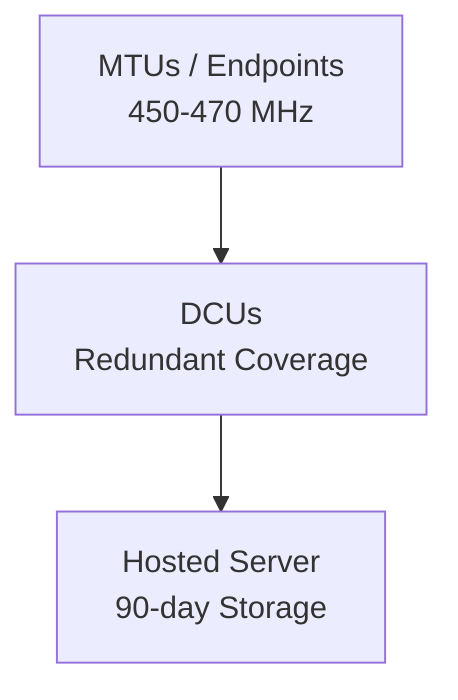

# Milton System Architecture Report

## Executive Summary
Milton, Delaware's AMI system is specified as a fixed network architecture for
utility metering.[1]
The RFQ calls for a complete AMI system with endpoints, network components, and
a hosted server platform.[1]
Two-way communications in the 450-470 MHz band connect MTUs and DCUs.[1]

- Fixed network AMI architecture for utility metering.[1]
- **MTU** endpoints and **DCU** collectors are core field components.[1]
- Two-way **450-470 MHz** radio links support data exchange.[1]
- Redundant coverage is required across the network layer.[1]
- Open architecture is specified for the overall system.[1]

## Scope and Source
- Primary source is the Milton, Delaware AMI RFQ bid package.[1]
- The RFQ describes hardware, network design, communications, and software.[1]
- Architectural focus includes MTUs, DCUs, and a hosted server tier.[1]

## System Overview
The architecture organizes endpoints, collectors, and a server in a fixed
network flow.[1]
Two-way 450-470 MHz communications link MTUs to DCUs.[1]

### Logical Flow
- MTUs operate at the endpoint tier in the fixed network.[1]
- DCUs provide collection coverage for MTU communications.[1]
- A hosted server tier receives data from DCUs.[1]

## Architecture Diagram
Text alternative: MTUs/endpoints communicate via 450-470 MHz to DCUs, which then
forward data to a hosted server tier.[1]



## Hardware Components

### MTU / Endpoint
- **MTU** units are specified as metering endpoints in the fixed network.[1]
- MTU housings are molded plastic enclosures.[1]
- MTUs are hermetically sealed per RFQ requirements.[1]
- MTUs operate from -30C to +70C per the RFQ.[1]
- MTU transmission intervals are defined in the RFQ.[1]

### DCU / Collector
- **DCU** units are part of the fixed network infrastructure.[1]
- DCUs provide redundant coverage in the network design.[1]
- DCU power requirements are specified in the RFQ.[1]
- DCU memory requirements are specified in the RFQ.[1]
- DCUs connect to MTUs using two-way 450-470 MHz communications.[1]

### Component Comparison
| Component | Role | Noted specifications |
| --- | --- | --- |
| **MTU** | Endpoint device in fixed network.[1] | Molded, sealed, -30C to +70C.[1] |
| **DCU** | Network collector with redundancy role.[1] | Power and memory in RFQ.[1] |

## Network Design and Coverage
- Fixed network topology is required for the AMI system.[1]
- Redundant coverage is specified for DCU deployment.[1]
- Two-way communications are required between endpoints and collectors.[1]
- The 450-470 MHz band is specified for RF communications.[1]
- Open architecture is part of the network requirements.[1]

## Communications and Data Flow

### Radio Communications
- Two-way 450-470 MHz links connect MTUs and DCUs.[1]
- MTU transmission intervals are defined in the RFQ.[1]
- The RFQ specifies fixed network radio communications.[1]

### Backhaul and Server
- Data is forwarded from DCUs to a hosted server platform.[1]
- Hosted server storage is specified at 90 days.[1]
- The server tier is part of the complete AMI system scope.[1]

## Software and Data Management
- The RFQ specifies a hosted server component for AMI data management.[1]
- Open architecture requirements apply to the system's software layer.[1]
- The server tier includes defined storage requirements in the RFQ.[1]
- Two-way communications support data exchange in the AMI system.[1]

## Reliability and Redundancy
- Redundant coverage is required in the DCU network layer.[1]
- Redundancy is included as a network design requirement.[1]
- The system is specified as a complete AMI solution for Milton.[1]

## Operational Features
- No-flow detection is listed as an advanced AMI feature.[1]
- High-flow detection is listed as an advanced AMI feature.[1]
- MTU transmission intervals support operational reads.[1]
- Two-way communications are part of the operational design.[1]

## Deployment and Scalability
- The RFQ scope includes MTUs, DCUs, and server tiers.[1]
- Fixed network AMI is specified for Milton, Delaware.[1]
- Open architecture requirements guide system deployment.[1]

## Open Architecture and Interoperability
- Open architecture is explicitly required in the RFQ.[1]
- The open architecture requirement applies to the AMI system end-to-end.[1]
- MTUs, DCUs, and the server tier are within the open architecture scope.[1]

## Conclusion
The RFQ defines a fixed network AMI architecture with MTUs, DCUs, two-way
450-470 MHz links, and a hosted server tier.[1]
Redundancy and open architecture are key requirements of the system design.[1]

## Validation Snippet (commented)
```python
# python3 -c "import sys; print(len(open('milton_system_architecture_report.md').read()))"
```

## Sources
- RFQ-BID-PACKAGE.pdf for the Milton, Delaware AMI system.[1]
- The RFQ defines hardware requirements for MTUs and DCUs.[1]
- The RFQ defines network and communications requirements.[1]

Report length: 5097 chars.
